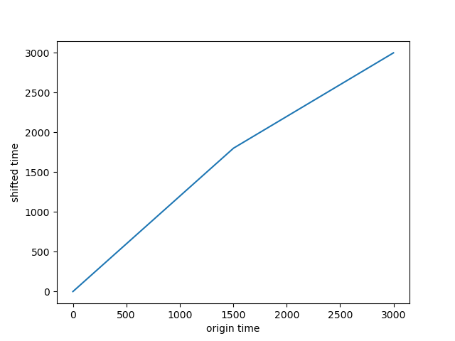
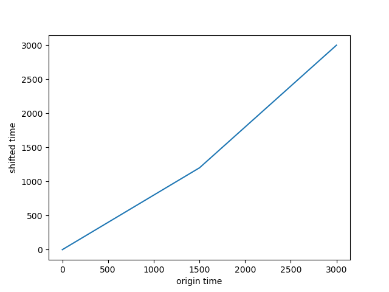

Classify [MNIST Audio](https://www.kaggle.com/alanchn31/free-spoken-digits) using Spectrograms.
Follow the method of using [CNN](https://www.kaggle.com/christianlillelund/classify-mnist-audio-using-spectrograms-keras-cnn) to classify audio by spectrogram.

Applying 2 different types of data augmentations:
* White noise
* Time shifting

Two types of nolinear time shifting
1. 
2. 

In this way, we increase the accuracy from around 90.0% to 99.5%

Group member: Yuhui Xu, yx2209, N18582390